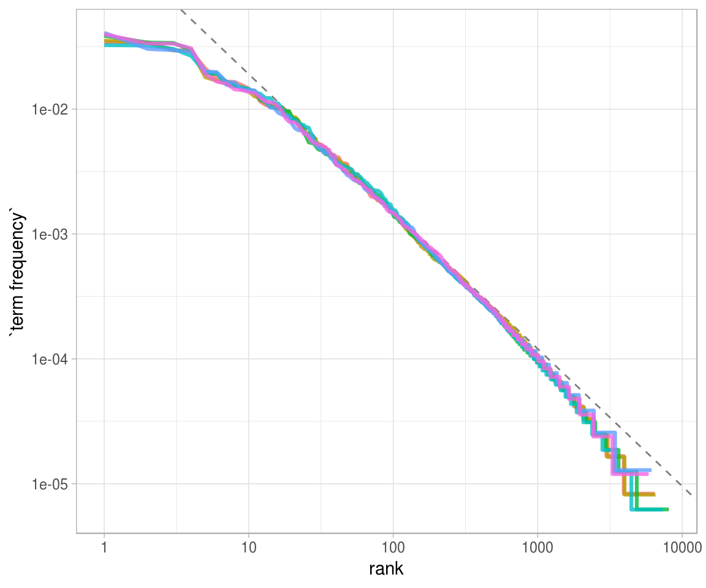
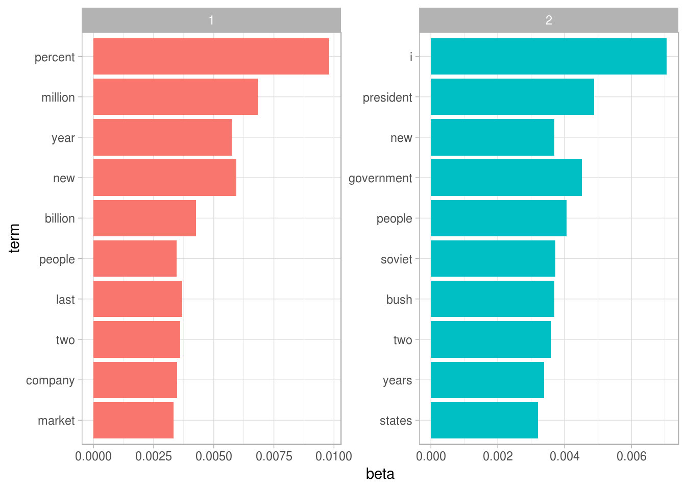

# Text Mining with R Overview Notes

[TOC]

## 1 The tidy text format

The base data structure to work with is a [tidy](../reading/Wickham2014 - Tidy Data.pdf) dataframe. Other potential formats include char vectors, Corpus[^1], and Document-term matrix[^2] .

[Tokenisation](https://nlp.stanford.edu/IR-book/html/htmledition/tokenization-1.html)[^3] is an important aspect of text mining, with tidytext normally composed of word tokens for most analysis, but sentence tokens are also common.

Term Frequency is an essential statistic, given for each term by:

$$\text{tf}(t,d) = \frac{f_{t,d}}{\sum_{t' \in d} f_{t',d}}$$

where $t$ = term, $d$ = document, and $f_{t,d}$ = raw count[^4]

## 2 Sentiment analysis with tidy data

Analysing emotional intent of words (pragmatics). Performed by an inner join of the analysed text, and a pre-made sentiment lexicon. **NB**: different lexicons have different associated sentiments (obviously). Various analytics can be taken from the created dataframe, such as common negative & positive words, wordclouds, etc.

## 3 Analyzing word and document frequency: tf-idf

### 3.1

To quantify what a document is about, a useful metric is to assess a terms *inverse document frequency* (idf), among a corpus of documents. It tells us how common a term may be in a corpus. idf is given by:

$$\text{idf}(t,D) = \text{log} \frac{N}{|\{ d \in D : t \in d \}|} = \text{log} \frac{N}{n_t}​$$

where $D$ = corpus, $N$ = total documents in corpus ($N = |D|$), and $|\{ d \in D : t \in d \}|$ = number of documents $d$ that term $t$ appears in.

### 3.2 

Zipf's law is a commonly observed distribution of term frequencies among text. Zipf's law states that

> The frequency that a word appears is inversely proportional to it's rank

Formalised as part of power law

$$f(r) \sim  r^{-\alpha}$$

with $r$ = rank, and zipf's law essentially stating that $\alpha​$ = 1

For more on Zipf's law, see [Thurner2015](../reading/Thurner2015 - Understanding Zipfs Law of Word Frequencies through Sample Space Collapse in Sentence Formation.pdf)

It is easy to analyse empirically, leading to visualisation such as:

### 3.3

tf-idf is a weighting given to a term that displays how common it is in a document, relative to a corpus. tg-idf is:

> 1. highest when $t$ occurs many times within a small number of documents (thus lending high discriminating power to those documents); 
> 2.  lower when the term occurs fewer times in a document, or occurs in many  documents (thus offering a less pronounced relevance signal); 
> 3.  lowest when the term occurs in virtually all documents

(from [Manning2008](https://nlp.stanford.edu/IR-book/html/htmledition/tf-idf-weighting-1.html))

tf-idf is given by:

$$\text{tf_idf}(t,d,D) = \text{tf}(t,d) \cdot \text{idf}(t,D)$$

and of note, there are several different tf-idf weighting schemes, as per the [tf-idf wikipedia page](https://en.wikipedia.org/w/index.php?title=Tf%E2%80%93idf&oldid=883826958#Term_frequency%E2%80%93Inverse_document_frequency)

## 4 Relationships between words: n-grams and correlations

The relationships between words are important, and can be assessed using **n-grams**[^5], usually bigrams. The sequence of word bigrams derived from the phrase

> Roses are red. Sky is blue

would be

1. roses are
2. are red
3. red sky
4. sky is
5. is blue

Bigrams could be visualised in a network.

**Correlation** is a good measure for assessing relationships between terms/tokens over various section (sentence, chapter, document etc.) This is typically done using a phi coefficient, and can be structured as a correlation matrix. Using the example from above, on a sentence-level offset, we would have the following correlation matrix:

|       | roses | are  | red  | sky  | is   | blue |
| ----- | ----- | ---- | ---- | ---- | ---- | ---- |
| roses | 1     | 1    | 1    | 0    | 0    | 0    |
| are   | 1     | 1    | 1    | 0    | 0    | 0    |
| red   | 1     | 1    | 1    | 0    | 0    | 0    |
| sky   | 0     | 0    | 0    | 1    | 1    | 1    |
| is    | 0     | 0    | 0    | 1    | 1    | 1    |
| blue  | 0     | 0    | 0    | 1    | 1    | 1    |

As mentioned above, correlation is typically measured by phi, the binary measure between words. The following table, and associated formula, gives phi between words;

|            | Has word Y    | No word Y     | Total        |
| ---------- | ------------- | ------------- | ------------ |
| Has word X | $n_{11}$      | $n_{10}$      | $n_{1\cdot}$ |
| No word X  | $n_{01}$      | $n_{00}$      | $n_{0\cdot}$ |
| Total      | $n_{\cdot 1}$ | $n_{\cdot 0}$ | n            |

where $n$ is the count of sections for which the associated situations as specified on the table, occur. Finally, this gives us:

$$\phi=\frac{n_{11}n_{00}-n_{10}n_{01}}{\sqrt{n_{1\cdot}n_{0\cdot}n_{\cdot0}n_{\cdot1}}}$$

We can then find closely correlated tokens through those which occur in the same section of work.

## 5 Converting to and from non-tidy formats

Section mainly refers to technical specifics of data structures

## 6 Topic modeling

Topic Modelling is where we use unsupervised learning to assign documents to groups. The most popular method is **Latent Dirichlet Allocation** (LDA). LDA is guided by two principles:

1. Every document is a mixture of topics
2. Every topic is a mixture of words

Using LDA, we can produce output such as the following, which split an Associated Press dataset into what seems to be "Politcs" and "Finance":

LDA lends itself to several metrics:

- $\beta$ is the per-topic-per-word probabilities, shown in the above plot
- log ratio, giving the terms with the greatest difference in $\beta$, given by $\text{log}(\frac{\beta_2}{\beta_1})$
- $\gamma$ is the per-document-per-topic probabilities, giving the proportion of words from a document that are generated from a particular topic

[^1]: Raw strings annotated with metadata.
[^2]: Sparse matrix describing a collection (i.e., a corpus) of documents with one row for each document and one column for each term. The value in the matrix is typically word count or tf-idf.
[^3]: Given a character sequence and a defined document unit, tokenization is the task of chopping it up  into pieces, called  *tokens* , perhaps at the same time throwing away certain characters, such as punctuation.
[^4]: number of times term $t$ occurs in document $d$.
[^5]: a contiguous sequence of *n* items from a document. The items can be [phonemes](https://en.wikipedia.org/wiki/Phoneme), [syllables](https://en.wikipedia.org/wiki/Syllable), [letters](https://en.wikipedia.org/wiki/Letter_(alphabet)), [words](https://en.wikipedia.org/wiki/Word) or [base pairs](https://en.wikipedia.org/wiki/Base_pairs) according to the application.