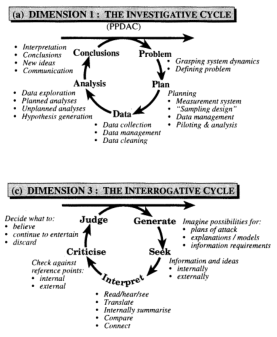
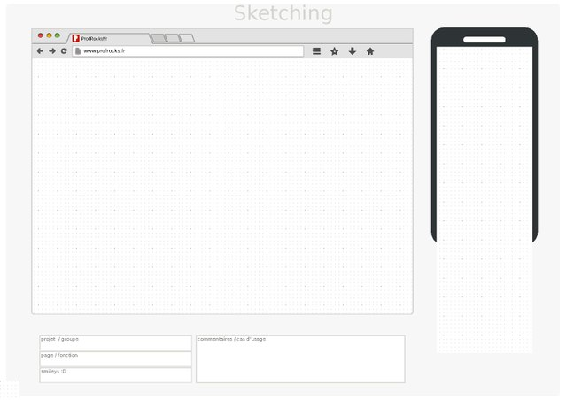

# UX / UI

[TOC]

## Preliminary considerations

### UX Resources:

- [Wikipedia - User Experience Design](https://en.wikipedia.org/wiki/User_experience_design)
- [UX Glossary](https://uxplanet.org/ux-glossary-task-flows-user-flows-flowcharts-and-some-new-ish-stuff-2321044d837d)

### UX: Inputting data

It is a pain to have to find a text, download it, then input it into iNZight for analysis. I would much prefer to do it all in-app, similar to the spatial analysis that it has already. Different forms of text will necessitate different inputs (eg. twitter, gutenberg, wikipedia, film scripts/subtitles). Preferably, the text would be live, rather than having classical *example* datasets. eg. a search box, that would pull a searched text from the Gutenberg archive, or live twitter results etc.

### UX: Non-Linearity

Text analysis, like all data analysis, is a non-linear flow. The question becomes, how to embody that flow in a ui? Examples of proposed data analysis flows include:

A stackexchange [answer](https://ux.stackexchange.com/questions/49765/how-to-create-a-non-linear-wizard) has some insights; I particularly like the notion of maintaining a summary, and clear directions.

### UI Resources:

- [Microsoft Guidelines](https://developer.microsoft.com/en-us/windows/apps/design)
- [macOS Guidelines](https://developer.apple.com/design/human-interface-guidelines/macos/overview/themes/)
- [Wikipedia - User Interface #Interface_design](https://en.wikipedia.org/wiki/User_interface#Interface_design)

### UI: General

UI must evolve organically with the product. Regardless, there are some worthwhile concepts to keep in mind that inform and motivate the process.

An interesting comparison: [skeuomorphism](https://en.wikipedia.org/wiki/Skeuomorph) vs [flat design](https://en.wikipedia.org/wiki/Flat_design)

From Wikipedia:

> All great interfaces share eight qualities or characteristics:
> 1. **Clarity** The interface avoids ambiguity by making everything clear through language, flow, hierarchy and metaphors for visual elements.
> 2. **Concision**[[14\]](https://en.wikipedia.org/wiki/User_interface#cite_note-artofunix-14)  It's easy to make the interface clear by over-clarifying and labeling  everything, but this leads to interface bloat, where there is just too  much stuff on the screen at the same time. If too many things are on the  screen, finding what you're looking for is difficult, and so the  interface becomes tedious to use. The real challenge in making a great  interface is to make it concise and clear at the same time.
> 3. **Familiarity**[[15\]](https://en.wikipedia.org/wiki/User_interface#cite_note-15)  Even if someone uses an interface for the first time, certain elements  can still be familiar. Real-life metaphors can be used to communicate  meaning.
> 4. **Responsiveness**[[16\]](https://en.wikipedia.org/wiki/User_interface#cite_note-16)  A good interface should not feel sluggish. This means that the  interface should provide good feedback to the user about what's  happening and whether the user's input is being successfully processed.
> 5. **Consistency**[[17\]](https://en.wikipedia.org/wiki/User_interface#cite_note-17) Keeping your interface consistent across your application is important because it allows users to recognize usage patterns.
> 6. **Aesthetics**  While you don't need to make an interface attractive for it to do its  job, making something look good will make the time your users spend  using your application more enjoyable; and happier users can only be a  good thing.
> 7. **Efficiency** Time is money, and a great interface should make the user more productive through shortcuts and good design.
> 8. **Forgiveness** A good interface should not punish users for their mistakes but should instead provide the means to remedy them.

In light of the above, I think Cassidy was on the right track with her [program](https://usresp-student.shinyapps.io/text_analysis/) explaining and hand-holding along the process. I think iNZight may have too much tucked away in the top toolbar, and having it clear and easily accessible will greatly improve ease of access. A [template](https://en.wikipedia.org/wiki/File:Mobile_sketch_template.pdf):

Hierarchical methods and tools within each part of the process is somewhat restrictive, especially for a nonlinear workflow

